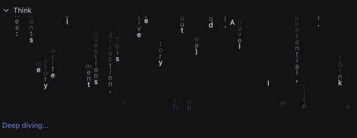

[English](README.md) | [简体中文](README.zh-CN.md)

# Matrix Think for DSH

Matrix Think for DSH turns expanded Think output in DeepSeek Harness Web into digital rain made from the live reasoning text.

[](assets/dsh-matrix-think-demo.mp4)

[](https://afterglow.watch)
[](https://github.com/deepseek-ai/deepseek-harness)
[](https://www.typescriptlang.org/)
[](LICENSE.md)

> Unofficial community plugin. Not affiliated with or endorsed by DeepSeek AI.

## Why

When I first tried DSH and ran a few prompts with DeepSeek Lightning, I was amazed by how fast its thinking text blasted past. I could barely read it, so I thought: why not turn it into a fun animation while the model works? I also turned every em dash in the model's thinking into a whale, just for extra fun. 🐋

## Install

```sh
dsh plugin --profile web add github:me93-ghb/dsh-matrix-think
dsh web
```

Submit a prompt, then expand **Think** while the model runs. Open **Settings**, select **Plugins**, then use the **Matrix Think** switch to turn the effect on or off in this browser.

Remove the plugin with:

```sh
dsh plugin --profile web remove dsh-matrix-think
```

## What it does

Each whitespace-separated word becomes one vertical rain stream. The head appears first, then the remaining letters form an ordered trail. New words wait for the current stream to pass below the box. When reasoning stops, the rain stops and lays out the words in sentence order.

The canvas reads the font, background, grey, and Deep diving blue from DSH theme tokens. At least one visible stream uses the blue accent. Em dashes appear as whale emoji inside the effect.

The plugin runs in the browser. It sends no data, makes no network requests, and has no host-side behavior.

## Develop

```sh
pnpm install
pnpm check
pnpm pack
```

Install the resulting archive into a local DSH Web profile to test the assembled plugin:

```sh
dsh plugin --profile web add ./dsh-matrix-think-0.1.0.tgz
```

The TypeScript source compiles to the committed `lib/client.js` browser bundle. The test suite checks the native setting, streamed DOM ownership, stop state, theme tokens, word queues, phase noise, blue handoff, letter reveal, and whale substitution.

## Compatibility

DeepSeek Harness is in developer preview. This plugin currently depends on the Think row's `data-variant="think"`, `data-state`, and disclosure markup. A DSH Web renderer change may require a selector update.
